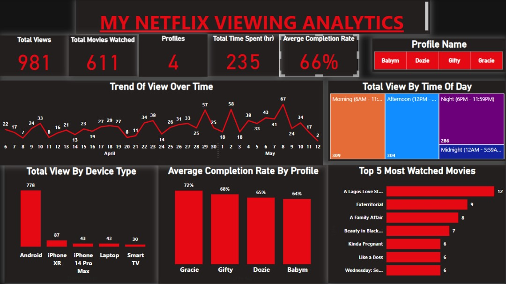

# Netflix-Viewing-Insights-Recommender

This project combines data analysis and machine learning to explore Netflix viewing patterns and build a personalized movie recommendation system using viewing history. It includes a Power BI dashboard and an interactive Streamlit web app.
## 🔍 Project Overview
After losing my job, I became deeply engrossed in Netflix, which inspired me to turn my viewing history into a data analytics project. This repository showcases:

A Power BI dashboard for insightful visual analytics of viewing behavior.
A Python-powered recommendation engine based on watch history.
A Streamlit app for recommending movies.

### 📊 Dashboard Preview
Power BI dashboard includes:

Total Views
Completion Rate
Device Analysis
Most Watched Titles
View Time Trends

### 🤖 Recommendation System
The recommendation engine uses cosine similarity on TF-IDF vectorization of titles. It suggests similar movies based on what you've already watched.

### 🌐 Future Enhancements
Add genre metadata using the TMDb API

### 📚 Credits
Netflix for the data export

Scikit-learn, Pandas, Streamlit

Personal motivation and curiosity
